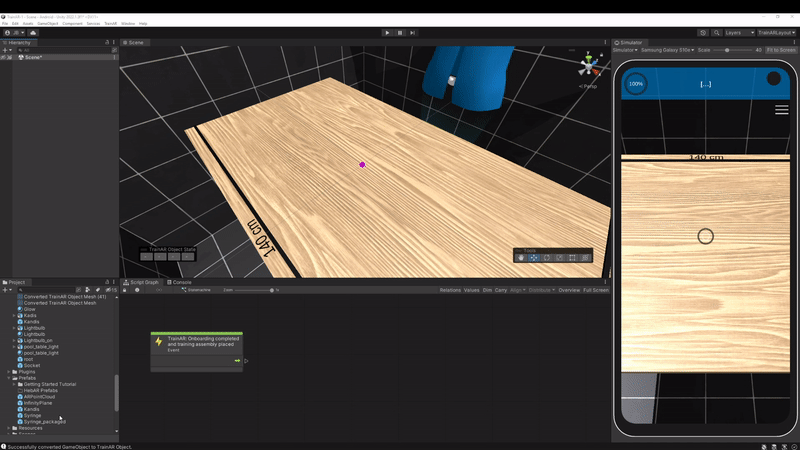

# Swapping or modifying TrainAR Objects during a training

One of the problem you'll run in quite frequently when creating trainings with *TrainAR* is that you want to modify or swap out **TrainAR Objects** all together. This can be achieved in various ways with. Which one is used best depends on the kind of assets you're using.

## Replacing the whole TrainAR Object
You'll need to have prepared two 3D models as TrainAR Objects. One **replacing object** and one to be **replaced object**. Both need to be added to the training setup from the beginning, the **replacing object** can be set to invisible if it's not supposed to be in the training at training startup, from a user perspective.

To replace one object with another use the *TrainAR Node: Object Helper* with the option *Replace TrainAR Object*. In the *Object name* textfield of the node put in the name of the **replaced object** and in the *Replace with* text field the name of the **replacing object**.

Following are two examples that demonstrate this process.

### Example 1: Simple replacement
In this example we have a packaged syringe that is supposed to be unpacked by the model. The user can do this, by triggering an *Interact* on the packaged syringe. As a result, the packaged syringe model should be replaced by the unpacked syringe.

Add both **TrainAR Objects** in the training setup. Set the **replacing object**, in this case the syringe, to invisible.

To open the package, the user is supposed to interact with the packaged syringe. Consequently, add a [*TrainAR Action*](../manuals/ActionNodes.md) node to the script graph, which points to the packaged syringe **TrainAR Object**. As a result the packaged syringe is replaced with the syringe itself. Therefore add a [*TrainAR Object Helper*](../manuals/ObjectHelperNode.md) node and choose the option *Replace TrainAR Object*. Then, enter the object names of the packaged syringe and the syringe in the respective fields in the node.

### Example 2: Combining two objects to one
Sometimes you may want to model the attachment of one model to another. This can also be realized with the [*TrainAR Object Helper*](../manuals/ObjectHelperNode.md) node, but with an additional step.

In this example we want to connect a needle to the syringe. For this, three **TrainAR Objects** are needed: the syringe without needle, the syringe with needle and the needle. The syringe with needle needs to be set to invisible at the start of the training. At first we again add a [*TrainAR Action*](../manuals/ActionNodes.md) node as a trigger for the replacement process, this time set to combine. The *grabbed object* in this case is the syringe and the *stationary object* is the needle. Next, the syringe is replaced via a *TrainAR Object Helper* node and since the needle is now attached to the syringe, the needle can be set to invisible. This is done as well with a *TrainAR Object Helper* node, but with the option *Toggle Invisible*.

